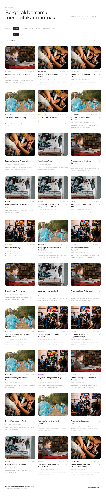
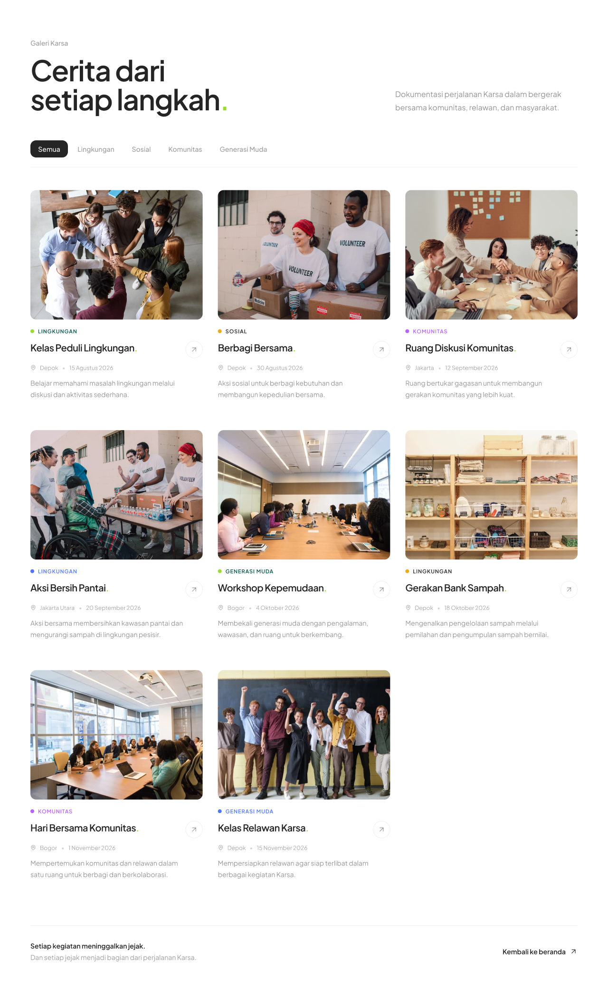

# KARSA — Project Development

> A community platform designed to encourage young people to take part in positive activities and create meaningful impact.

---

## Project Overview

**Karsa** adalah platform komunitas yang menjadi wadah bagi generasi muda untuk menemukan, mengikuti, dan berkontribusi dalam berbagai kegiatan sosial dan lingkungan.

Project ini dikembangkan secara kolaboratif dengan pembagian tanggung jawab berdasarkan role dan task masing-masing anggota tim.

---

## Tech Stack

### Front-End

| Technology        | Description                                                                |
| ----------------- | -------------------------------------------------------------------------- |
| **Next.js**       | Framework untuk membangun aplikasi web                                     |
| **React**         | Library untuk membangun komponen dan user interface                        |
| **TypeScript**    | Bahasa pemrograman dengan sistem tipe untuk membuat kode lebih terstruktur |
| **Tailwind CSS**  | Framework CSS untuk styling dan responsive design                          |
| **Framer Motion** | Library untuk membuat animasi dan transition                               |
| **Lucide React**  | Library icon untuk user interface                                          |
| **Sonner**        | Library untuk menampilkan toast notification                               |
| **React Player**  | Library untuk menampilkan dan memutar video                                |

### Back-End

| Technology      | Description                                          |
| --------------- | ---------------------------------------------------- |
| **Express**     | Framework untuk membuat server dan REST API          |
| **TypeScript**  | Digunakan untuk pengembangan backend                 |
| **Drizzle ORM** | ORM untuk berinteraksi dengan database               |
| **MySQL2**      | Driver untuk koneksi ke database MySQL               |
| **Cloudinary**  | Digunakan untuk menyimpan dan mengelola gambar/media |
| **Multer**      | Middleware untuk menangani upload file               |
| **Zod**         | Digunakan untuk validasi data request                |
| **CORS**        | Mengatur akses request antara frontend dan backend   |
| **dotenv**      | Mengelola environment variables                      |

### Database & Development Tools

| Technology       | Description                                                        |
| ---------------- | ------------------------------------------------------------------ |
| **MySQL**        | Database untuk menyimpan data aplikasi                             |
| **Laragon**      | Local development environment untuk menjalankan MySQL secara lokal |
| **Postman**      | Digunakan untuk testing dan pengujian REST API                     |
| **Git & GitHub** | Version control dan kolaborasi project                             |

---

## Development Setup

### 1. Clone Repository

Clone repository project menggunakan Git:

```bash
git clone <repository-url>
cd karsa
```

### 2. Install Dependencies

Install seluruh dependencies yang dibutuhkan:

```bash
npm install
```

### 3. TypeScript Setup

Project menggunakan **TypeScript** pada frontend dan backend.

File TypeScript menggunakan ekstensi:

```text
.ts
```

Sedangkan file yang menggunakan TypeScript dengan JSX menggunakan:

```text
.tsx
```

Konfigurasi TypeScript disimpan pada:

```text
tsconfig.json
```

### 4. Environment Variable

Konfigurasi yang diperlukan oleh project disimpan dalam file `.env`.

Contoh:

```env
DATABASE_URL=your_database_connection
PORT=3000
CLOUDINARY_CLOUD_NAME=your_cloud_name
CLOUDINARY_API_KEY=your_api_key
CLOUDINARY_API_SECRET=your_api_secret
```

> File `.env` tidak dimasukkan ke repository GitHub karena dapat berisi informasi yang bersifat rahasia.

### 5. Setup Database dengan Laragon

Laragon digunakan untuk menjalankan **MySQL** secara lokal selama proses development.

Langkahnya:

1. Buka Laragon.
2. Jalankan service **MySQL**.
3. Buat atau siapkan database yang digunakan oleh project.
4. Pastikan konfigurasi database pada `.env` sudah sesuai.
5. Jalankan backend project.

### 6. Menjalankan Backend

Backend menggunakan **Express + TypeScript**.

Jalankan backend dengan:

```bash
npm run dev
```

Jika berhasil, server akan berjalan pada:

```text
http://localhost:3000
```

### 7. Testing API dengan Postman

Setelah backend berjalan, endpoint API dapat diuji menggunakan **Postman**.

Contoh HTTP method yang digunakan:

| Method      | Function         |
| ----------- | ---------------- |
| `GET`       | Mengambil data   |
| `POST`      | Menambahkan data |
| `PUT/PATCH` | Mengubah data    |
| `DELETE`    | Menghapus data   |

Contoh endpoint:

```text
GET     /api/v1/posts
POST    /api/v1/posts
GET     /api/v1/posts/:id
PUT     /api/v1/posts/:id
DELETE  /api/v1/posts/:id
```

Postman digunakan untuk memastikan setiap endpoint dapat menerima request dan memberikan response sesuai dengan yang diharapkan sebelum digunakan oleh frontend.

---

## Development Progress

**7 / 8 Tasks Completed**

`██████████████████░░` **87.5%**

|      Status     | Description            |
| :-------------: | ---------------------- |
|     **DONE**    | Task telah selesai     |
| **IN PROGRESS** | Task sedang dikerjakan |
|    **TO DO**    | Task belum dikerjakan  |

---

## Task Management

| No. | Task                                            | PIC                 |  Status  |          Issue         |
| :-: | ----------------------------------------------- | ------------------- | :------: | :--------------------: |
|  01 | Membuat Design Landing Page                     | **Anggita — UI/UX** | **DONE** |  [#4](../../issues/4)  |
|  02 | Membuat Navbar                                  | **Jona — FE**       | **DONE** |  [#5](../../issues/5)  |
|  03 | Membuat Page Beranda                            | **Jona — FE**       | **DONE** |  [#6](../../issues/6)  |
|  04 | Membuat Page Tentang Kami — Tentang Karsa       | **Jona — FE**       | **DONE** |  [#7](../../issues/7)  |
|  05 | Membuat Page Tentang Kami — Visi & Misi         | **Jona — FE**       | **DONE** |  [#8](../../issues/8)  |
|  06 | Membuat Page Tentang Kami — Program             | **Jona — FE**       | **DONE** |  [#9](../../issues/9)  |
|  07 | Membuat Page Tentang Kami — Dampak & Kontribusi | **Jona — FE**       | **DONE** | [#10](../../issues/10) |
|  08 | Membuat Page Kegiatan                           | **Jona — FE**       | **DONE** | [#11](../../issues/11) |

---

## Team Structure

| Member      | Role                | Responsibility                                     |
| ----------- | ------------------- | -------------------------------------------------- |
| **Al**      | Project Manager     | Project planning, task management, coordination    |
| **Jona**    | Front-End Developer | Interface implementation and page development      |
| **Arkana**  | Back-End Developer  | Backend, API, and database development             |
| **Anggita** | UI/UX Designer & QA | UI/UX design, documentation, and quality assurance |

---

## Current Sprint

### Completed

| Task                |  Status  |
| ------------------- | :------: |
| Design Landing Page | **DONE** |
| Navbar              | **DONE** |
| Page Beranda        | **DONE** |
| Tentang Karsa       | **DONE** |
| Visi & Misi         | **DONE** |
| Program             | **DONE** |
| Dampak & Kontribusi | **DONE** |
| Page Kegiatan       | **DONE** |

### To Do

Task berikutnya akan ditambahkan ke dalam **GitHub Issues** sesuai prioritas dan hasil koordinasi tim.

---

## Project Status

| Area         |  Status  |
| ------------ | :------: |
| UI/UX Design | **DONE** |
| Landing Page | **DONE** |
| Navigation   | **DONE** |
| Tentang Kami | **DONE** |
| Kegiatan     | **DONE** |

---

## Tampilan Website

### Landing Page

<p align="center">
  
</p>

### Halaman Kegiatan

<p align="center">
  
</p>

### Halaman Detail Kegiatan

<p align="center">
  
</p>

### Halaman Galeri

<p align="center">
  
</p>

### Halaman Detail Galeri

<p align="center">
  
</p>

### Halaman Form Gabung Komunitas

<p align="center">
  
</p>

---

## Project Principle

> **"Mulai dari langkah kecil, ciptakan perubahan besar."**

Karsa dibangun dengan tujuan menghadirkan ruang digital yang mendorong generasi muda untuk bergerak, berkontribusi, dan menciptakan dampak positif di lingkungan sekitar.

---

<p align="center">
  <strong>KARSA</strong><br>
  Community • Action • Impact
</p>
pembagian tanggung jawab berdasarkan role dan task masing-masing anggota tim.

---

